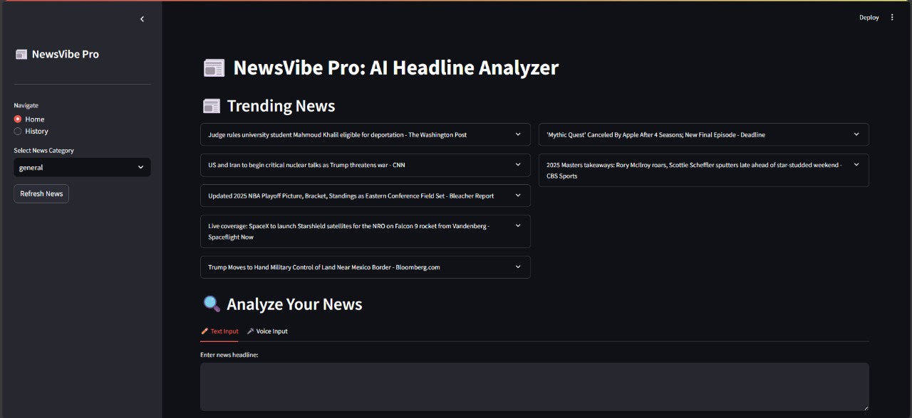
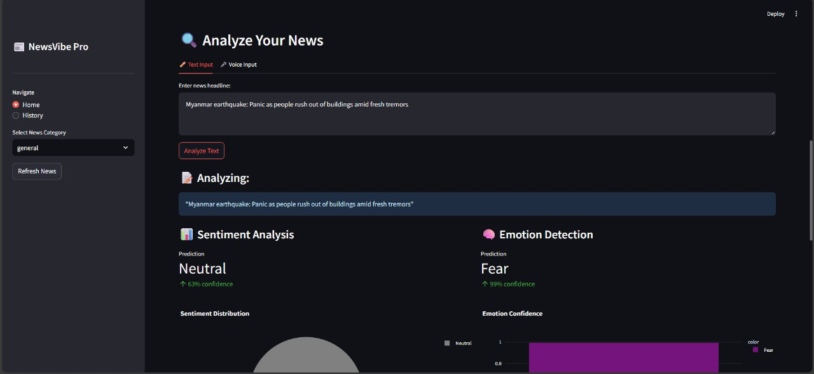
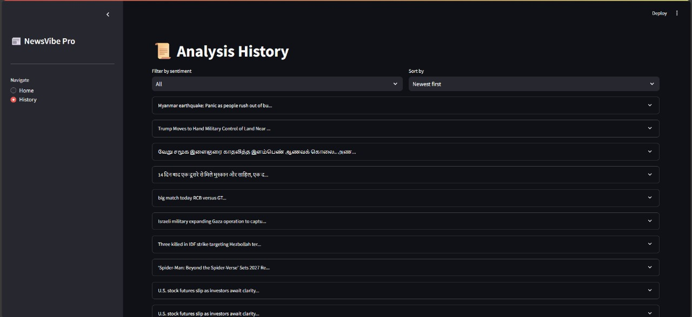

# 📰 News-Senti

News Headline Sentiment Analysis using NLP and Machine Learning to classify news headlines into **Positive**, **Negative**, or **Neutral** sentiments.



## 💡 Project Overview

This app helps users understand the sentiment behind news headlines. By leveraging **Natural Language Processing (NLP)** and a pre-trained **classification model**, the tool predicts whether a headline is **positive**, **negative**, or **neutral**.



## 🚀 Features

- 🧠 Built with a machine learning model trained on news headline sentiment data
- 🌐 Real-time prediction using a user-friendly **Streamlit** web app
- 📊 Clear sentiment output with visual feedback



---

## 🛠️ Tech Stack

- **Python**
- **NLP (TextBlob / NLTK / HuggingFace / Scikit-learn)**
- **Streamlit** – for frontend UI
- **Pandas, NumPy** – for data handling

---

## 📦 Installation

1. **Clone the Repository**
   ```bash
   git clone https://github.com/your-username/news-senti.git
   cd news-senti
   ```

2. **Create a Virtual Environment (Optional)**
   ```bash
   python -m venv venv
   source venv/bin/activate  # On Windows: venv\Scripts\activate
   ```

3. **Install Dependencies**
   ```bash
   pip install -r requirements.txt
   ```

---

## 🧪 How to Use

1. **Run the Streamlit App**
   ```bash
   streamlit run app.py
   ```

2. **Enter a News Headline**

3. **Get Instant Sentiment Feedback**

---

## 📁 Project Structure

```
news-senti/
│
├── app.py                    # Main Streamlit app
├── model.pkl                 # Trained ML model
├── preprocess.py             # Text preprocessing functions
├── requirements.txt          # Python dependencies
├── images/
│   ├── banner.png
│   ├── interface.png
│   └── output.png
└── README.md                 # Project documentation
```

---


---

## 📄 preprocess.py

```python
def clean_text(text):
    import re
    text = text.lower()
    text = re.sub(r'[^a-zA-Z\s]', '', text)
    text = re.sub(r'\s+', ' ', text).strip()
    return text
```

---

## 📄 requirements.txt

```txt
streamlit
scikit-learn
pandas
numpy
```

---

## 🔮 Future Improvements

- Use deep learning models like BERT for better accuracy
- Add keyword highlighting for sentiment explanation
- Include batch processing for analyzing multiple headlines

---

## 🙌 Acknowledgements

- Streamlit for interactive UI
- scikit-learn / HuggingFace for ML support
- Open datasets on headline sentiment

---


